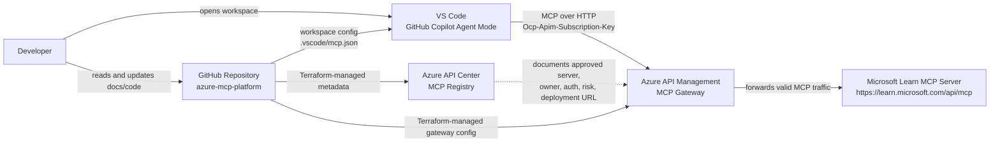
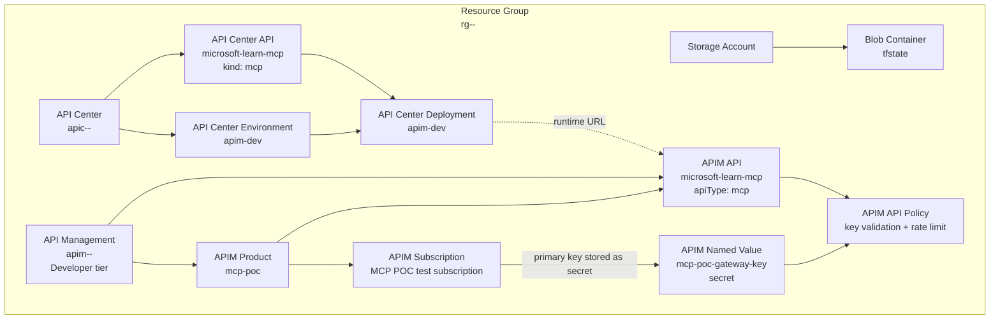
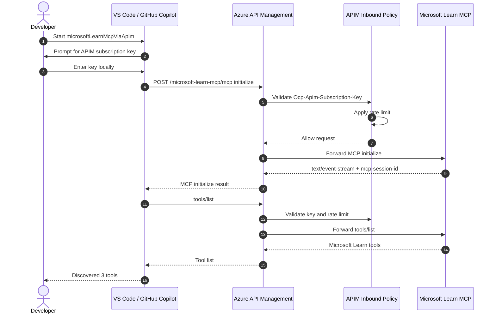
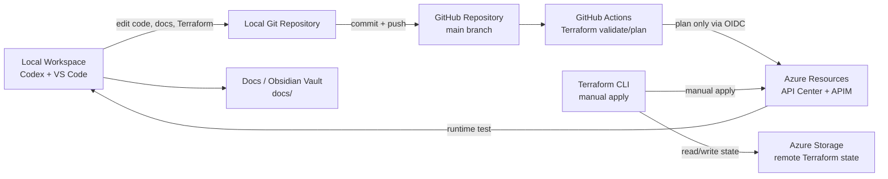

# Azure MCP Platform

Azure MCP Platform is a proof of concept for governing Model Context Protocol (MCP) servers with Azure-native services.

The project demonstrates how an organization can register approved MCP servers, route MCP traffic through a governed gateway, and let VS Code with GitHub Copilot consume an approved MCP server without building a custom MCP server first.

## Table Of Contents

- [Purpose](#purpose)
- [Status](#status)
- [What This POC Proves](#what-this-poc-proves)
- [Architecture At A Glance](#architecture-at-a-glance)
- [System Context](#system-context)
- [Azure Resource Architecture](#azure-resource-architecture)
- [Runtime Flow](#runtime-flow)
- [Delivery And Operations](#delivery-and-operations)
- [Repository Structure](#repository-structure)
- [Azure Resources](#azure-resources)
- [Configuration](#configuration)
- [Deploy](#deploy)
- [Test](#test)
- [Security And Governance](#security-and-governance)
- [Cost Model](#cost-model)
- [Architecture Decisions](#architecture-decisions)
- [Known Limitations](#known-limitations)
- [Related Repositories](#related-repositories)
- [References](#references)

## Purpose

MCP allows AI hosts such as VS Code and GitHub Copilot to call external tools. That is powerful, but it creates an enterprise governance question:

> How can approved MCP servers be discovered, governed, secured, and operated centrally?

This repository proves a minimal Azure-based answer.

| Capability | POC Implementation | Why It Matters |
| --- | --- | --- |
| MCP host | VS Code with GitHub Copilot Agent mode | Represents the developer experience that should consume governed tools |
| MCP server | Microsoft Learn MCP | Provides useful read-only tools without custom server development |
| Registry | Azure API Center | Stores approved MCP server metadata, ownership, risk, auth, and runtime deployment information |
| Gateway | Azure API Management | Enforces access policy, rate limits, and routing before traffic reaches the upstream MCP server |
| Infrastructure | Terraform | Keeps the Azure platform reproducible |
| Delivery | GitHub Actions plan-only workflow | Validates infrastructure changes without automated apply |

The POC focuses on **registry, gateway, policy enforcement, and host integration**. Custom MCP server development is intentionally out of scope for the first iteration.

## Status

The technical POC is working.

| Area | Status | Evidence |
| --- | --- | --- |
| Azure foundation | Complete | Terraform deployed API Center, API Management, and remote state resources |
| MCP registry | Complete | Microsoft Learn MCP is registered in API Center with governance metadata |
| MCP gateway | Complete | API Management exposes Microsoft Learn MCP through an MCP API endpoint |
| Policy enforcement | Complete | APIM validates `Ocp-Apim-Subscription-Key` through policy and applies rate limiting |
| Direct gateway test | Complete | APIM returned `200`, `text/event-stream`, and `mcp-session-id` for MCP `initialize` |
| VS Code / Copilot test | Complete | VS Code discovered the Microsoft Learn MCP tools through APIM |
| Target enterprise auth | Planned | Entra ID/OAuth remains the target architecture, not the POC shortcut |
| Observability | Planned | APIM log validation should be added next |

Validated Microsoft Learn MCP tools:

| Tool | Purpose |
| --- | --- |
| `microsoft_docs_search` | Search Microsoft Learn documentation |
| `microsoft_code_sample_search` | Search official code samples |
| `microsoft_docs_fetch` | Fetch Microsoft Learn documentation content |

## What This POC Proves

This POC demonstrates an end-to-end governed MCP path:

1. A developer opens this repository in VS Code.
2. VS Code starts the configured remote HTTP MCP server.
3. VS Code sends MCP traffic to Azure API Management.
4. API Management validates the subscription key through an inbound policy.
5. API Management applies rate limiting.
6. API Management forwards valid traffic to Microsoft Learn MCP.
7. GitHub Copilot can discover and use the Microsoft Learn MCP tools.
8. Azure API Center stores registry and governance metadata for the approved MCP server.

The important result is not just that MCP traffic works. The important result is that the traffic passes through an Azure governance point before it reaches the upstream server.

## Architecture At A Glance

The architecture has two planes:

| Plane | Purpose | Azure Service |
| --- | --- | --- |
| Governance plane | Catalog approved MCP servers and describe ownership, risk, auth, exposure, and runtime deployment | Azure API Center |
| Runtime plane | Route MCP traffic, validate access, apply policy, and protect upstream MCP servers | Azure API Management |

The first upstream MCP server is Microsoft Learn MCP at `https://learn.microsoft.com/api/mcp`.

## System Context

This diagram shows the actors and systems involved in the POC.



Alternative rendered diagram variants are available in [docs/diagram-variants](docs/diagram-variants/README.md).

## Azure Resource Architecture

This diagram shows the deployed Azure resources and how they relate to each other.



Key implementation detail: the APIM MCP API is managed with `azapi_resource` because the AzureRM provider does not expose every required MCP API shape as a first-class resource yet.

## Runtime Flow

This sequence shows the end-to-end MCP startup and tool discovery path.



Important: APIM native `subscriptionRequired` is disabled for this API. The POC still uses an APIM subscription key, but the key is checked by an inbound policy against a secret APIM named value. This avoids a built-in APIM authentication challenge that caused VS Code Remote HTTP MCP to attempt OAuth/Dynamic Client Registration.

## Delivery And Operations

This diagram shows how local work, GitHub, Terraform, and Azure fit together.



For this POC, GitHub Actions validates and plans Terraform only. `terraform apply` remains manual.

## Repository Structure

```text
.
├── AGENTS.md
├── README.md
├── SECURITY.md
├── LICENSE
├── .github/
│   ├── azure-federated-credential.example.json
│   └── workflows/terraform-validate.yml
├── .vscode/
│   └── mcp.json
├── docs/
│   ├── decisions/
│   ├── diagram-variants/
│   ├── diagrams/
│   ├── runbooks/
│   └── references.md
└── infra/terraform/
```

| Path | Purpose |
| --- | --- |
| [README.md](README.md) | Main project documentation and first entry point |
| [AGENTS.md](AGENTS.md) | Project working conventions for Codex and other coding agents |
| [.vscode/mcp.json](.vscode/mcp.json) | VS Code Remote HTTP MCP server configuration |
| [infra/terraform](infra/terraform) | Terraform implementation for Azure resources |
| [docs/decisions](docs/decisions) | Architecture Decision Records |
| [docs/runbooks](docs/runbooks) | Operational procedures and manual test instructions |
| [docs/diagram-variants](docs/diagram-variants/README.md) | Alternative diagram sources and rendered variants |
| [docs/references.md](docs/references.md) | Consolidated source references |

The root README is the primary documentation surface. Files under `docs/` are supporting artifacts, runbooks, or appendices.

## Azure Resources

The POC uses generic resource naming so it can be adapted to another Azure subscription.

| Purpose | Example Pattern |
| --- | --- |
| Resource group | `rg-<project>-<env>` |
| Location | `westeurope` |
| Terraform state storage account | `<unique-storage-account-name>` |
| Terraform state container | `tfstate` |
| API Center registry | `apic-<project>-<env>` |
| API Management gateway | `apim-<project>-<env>` |
| APIM API | `microsoft-learn-mcp` |
| APIM product | `mcp-poc` |
| API Center API | `microsoft-learn-mcp` |
| API Center environment | `apim-dev` |
| API Center deployment | `apim-dev` |

Important endpoints:

| Purpose | Endpoint |
| --- | --- |
| APIM gateway | `https://<apim-name>.azure-api.net` |
| Microsoft Learn MCP through APIM | `https://<apim-name>.azure-api.net/microsoft-learn-mcp/mcp` |
| Upstream Microsoft Learn MCP | `https://learn.microsoft.com/api/mcp` |
| API Center MCP registry | `https://<api-center-name>.data.<region>.azure-apicenter.ms/workspaces/default/v0.1/servers` |

## Configuration

### Terraform Variables

Create a local variables file from the example:

```bash
cp infra/terraform/environments/dev/terraform.tfvars.example \
  infra/terraform/environments/dev/terraform.tfvars
```

Then replace the placeholder values in `terraform.tfvars`.

Local `*.tfvars` files are ignored by Git. Keep them local because they can contain personal, subscription-specific, or environment-specific values.

### GitHub Actions Variables

The Terraform validation workflow expects these repository variables:

| Variable | Purpose |
| --- | --- |
| `AZURE_CLIENT_ID` | Entra app registration client ID for GitHub OIDC |
| `AZURE_TENANT_ID` | Entra tenant ID |
| `AZURE_SUBSCRIPTION_ID` | Azure subscription ID |
| `TF_STATE_RESOURCE_GROUP_NAME` | Resource group containing Terraform state storage |
| `TF_STATE_STORAGE_ACCOUNT_NAME` | Storage account for Terraform state |
| `TF_STATE_CONTAINER_NAME` | Blob container for Terraform state |
| `TF_STATE_KEY` | State blob name, for example `dev.terraform.tfstate` |
| `API_CENTER_NAME` | API Center instance name |
| `API_MANAGEMENT_NAME` | API Management instance name |
| `API_MANAGEMENT_PUBLISHER_EMAIL` | APIM publisher email |

### VS Code MCP Configuration

The workspace MCP configuration lives in [.vscode/mcp.json](.vscode/mcp.json).

It defines one Remote HTTP MCP server:

| Setting | Value |
| --- | --- |
| Server name | `microsoftLearnMcpViaApim` |
| Type | `http` |
| URL | `https://<apim-name>.azure-api.net/microsoft-learn-mcp/mcp` |
| Header | `Ocp-Apim-Subscription-Key` |
| Secret handling | VS Code prompts locally; the key is not committed |

## Deploy

Prerequisites:

| Tool | Purpose |
| --- | --- |
| Azure CLI | Azure login and subscription context |
| Terraform CLI | Infrastructure deployment |
| GitHub CLI | GitHub repository and workflow setup |
| VS Code | MCP host validation |
| GitHub Copilot | MCP tool consumption from Copilot Chat |

Initialize Terraform:

```bash
terraform -chdir=infra/terraform init
```

Validate Terraform:

```bash
terraform -chdir=infra/terraform validate
```

Plan Terraform:

```bash
SUB=$(az account show --query id -o tsv)
TENANT=$(az account show --query tenantId -o tsv)

terraform -chdir=infra/terraform plan \
  -var-file="environments/dev/terraform.tfvars" \
  -var="subscription_id=$SUB" \
  -var="tenant_id=$TENANT"
```

Apply manually:

```bash
terraform -chdir=infra/terraform apply \
  -var-file="environments/dev/terraform.tfvars" \
  -var="subscription_id=$SUB" \
  -var="tenant_id=$TENANT"
```

## Test

### Direct Gateway Smoke Test

The direct gateway test verifies APIM before VS Code is involved.

| Test | Expected Result |
| --- | --- |
| Valid APIM key | `200`, `text/event-stream`, `mcp-session-id` |
| Missing APIM key | `401` from APIM policy |
| Invalid APIM key | `401` from APIM policy |
| Repeated calls beyond limit | `429` throttling response |

### VS Code / GitHub Copilot End-To-End Test

Get the APIM subscription key:

```bash
terraform -chdir=infra/terraform output -raw mcp_poc_subscription_primary_key
```

Then:

1. Open this repository in VS Code.
2. Open the Command Palette with `Shift` + `Command` + `P`.
3. Run `MCP: List Servers`.
4. Select `microsoftLearnMcpViaApim`.
5. Choose `Start Server`.
6. Enter the APIM subscription key when prompted.
7. Open GitHub Copilot Chat in Agent mode.
8. Confirm the Microsoft Learn MCP tools are available.

Expected VS Code output:

```text
Starting server microsoftLearnMcpViaApim
Connection state: Running
Discovered 3 tools
```

Prompt example:

```text
Use the Microsoft Learn MCP server to find official guidance for exposing an existing MCP server through Azure API Management.
```

Detailed runbook: [docs/runbooks/vscode-copilot-mcp-test.md](docs/runbooks/vscode-copilot-mcp-test.md)

## Security And Governance

### POC Controls

| Control | Implementation |
| --- | --- |
| Gateway access | APIM requires `Ocp-Apim-Subscription-Key` |
| Key validation | APIM inbound policy compares the header against a secret named value |
| Rate limiting | APIM policy limits calls per time window |
| Registry metadata | API Center records owner, status, risk, auth type, network exposure, tool access, and purpose |
| Terraform state | Remote state stored in Azure Storage |
| CI authentication | GitHub Actions uses OIDC for Azure-backed Terraform plans |
| Secret hygiene | Local `*.tfvars`, state files, plans, and credentials are ignored by Git |

### Registry Metadata

API Center records the Microsoft Learn MCP server with governance metadata:

| Field | Example Value |
| --- | --- |
| `owner` | `platform-team` |
| `environment` | `dev` |
| `status` | `approved` |
| `riskLevel` | `low` |
| `dataClassification` | `public` |
| `authType` | `subscription-key` |
| `networkExposure` | `public-poc` |
| `toolAccess` | `read-only` |
| `businessPurpose` | Microsoft Learn documentation lookup through governed MCP access |
| `upstreamServer` | `https://learn.microsoft.com/api/mcp` |
| `approvedForHosts` | VS Code, GitHub Copilot |
| `lastReviewed` | Review date for the registry entry |
| `documentationUrl` | `https://learn.microsoft.com/` |

### Target Direction

The POC uses subscription-key authentication because it is simple and fast to validate. The target enterprise direction is stronger:

| Area | POC | Target Direction |
| --- | --- | --- |
| Authentication | APIM subscription key checked by policy | Entra ID/OAuth with MCP-compliant authorization |
| Network exposure | Public APIM endpoint for local testing | Private networking, VPN, Dev Box, or controlled developer environment |
| Gateway tier | APIM Developer tier | Production-grade tier based on SLA, scale, private networking, and observability needs |
| Observability | Basic validation pending | APIM logs, Azure Monitor, dashboards, and alerting |
| Server scope | One read-only MCP server | Multiple approved MCP servers with registry-driven discovery |

## Cost Model

The main cost driver is Azure API Management.

| Component | Cost Character |
| --- | --- |
| API Management Developer tier | Ongoing monthly cost while provisioned; non-production and no SLA |
| API Center | Depends on Azure pricing and SKU availability |
| Storage account for Terraform state | Very small cost for this POC |
| Microsoft Learn MCP | External Microsoft endpoint; no custom hosting cost in this repo |

To avoid unnecessary spend, deprovision the Azure resources when the POC is not needed.

## Architecture Decisions

| Decision | Chosen Option | Why |
| --- | --- | --- |
| Registry | Azure API Center | Azure-native catalog for approved MCP server metadata and discovery |
| Gateway | Azure API Management | Azure-native policy enforcement, routing, subscription keys, and rate limiting |
| Initial MCP server | Microsoft Learn MCP | Useful read-only tools without custom server development |
| Initial host | VS Code with GitHub Copilot | Real target developer experience |
| Authentication for POC | Subscription key checked by APIM policy | Fast validation without OAuth setup |
| Enterprise auth direction | Entra ID/OAuth | Better fit for identity-based enterprise governance |
| Network model for POC | Public APIM endpoint | Faster local testing |
| Target network model | Private or controlled access path | Better enterprise security posture |
| Apply model | Manual Terraform apply | Keeps POC changes deliberate while CI validates and plans |

Detailed ADR: [ADR-001: Use Azure API Center and API Management for the MCP Registry/Gateway POC](docs/decisions/001-mcp-registry-gateway-poc.md)

## Known Limitations

| Limitation | Impact | Follow-Up |
| --- | --- | --- |
| APIM Developer tier has no SLA | Not production-ready | Evaluate production tiers later |
| Public APIM endpoint | Easier to test, weaker than private enterprise pattern | Add private networking or controlled developer access path |
| Subscription key auth | Good POC shortcut, weaker than identity-based auth | Design Entra ID/OAuth target architecture |
| One upstream MCP server | Proves the pattern, not full registry scale | Add more MCP servers after the platform pattern is stable |
| Observability not fully documented | Gateway operations are not yet easy to demonstrate | Add APIM log checks and Azure Monitor validation |

## Related Repositories

This repository contains only the Azure MCP Platform POC.

| Repository | Purpose | Visibility Intent |
| --- | --- | --- |
| `azure-mcp-platform` | Concrete Azure MCP registry/gateway POC | Public reference POC |
| `codex-cloud-workbench` | Personal cloud/Codex enablement and local workbench | Private |
| `codex-azure-project-template` | Reusable Azure/Codex project template and standards | Private |

## References

Core references used for this POC:

| Area | Reference |
| --- | --- |
| MCP architecture | [Model Context Protocol architecture](https://modelcontextprotocol.io/docs/learn/architecture) |
| MCP authorization | [MCP authorization specification](https://modelcontextprotocol.io/specification/2025-06-18/basic/authorization) |
| VS Code MCP servers | [VS Code MCP servers](https://code.visualstudio.com/docs/agent-customization/mcp-servers) |
| VS Code MCP configuration | [VS Code MCP configuration reference](https://code.visualstudio.com/docs/agents/reference/mcp-configuration) |
| APIM MCP gateway | [Expose and govern an existing MCP server with Azure API Management](https://learn.microsoft.com/en-us/azure/api-management/expose-existing-mcp-server) |
| API Center MCP registry | [Register and discover MCP servers in Azure API Center](https://learn.microsoft.com/en-us/azure/api-center/register-discover-mcp-server) |
| API Center metadata | [Set metadata properties in Azure API Center](https://learn.microsoft.com/en-us/azure/api-center/set-metadata-properties) |
| Terraform Azure backend | [Terraform AzureRM backend](https://developer.hashicorp.com/terraform/language/backend/azurerm) |
| GitHub OIDC for Azure | [GitHub Actions OIDC in Azure](https://docs.github.com/en/actions/how-tos/secure-your-work/security-harden-deployments/oidc-in-azure) |
| API Management pricing | [Azure API Management pricing](https://azure.microsoft.com/en-us/pricing/details/api-management/) |

Additional references are collected in [docs/references.md](docs/references.md).
