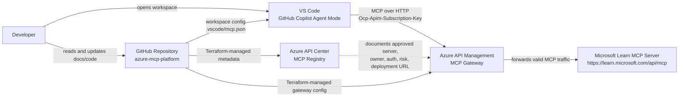
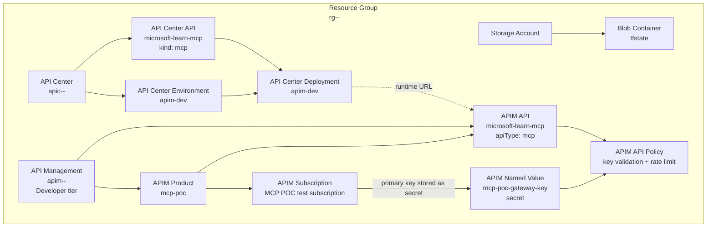
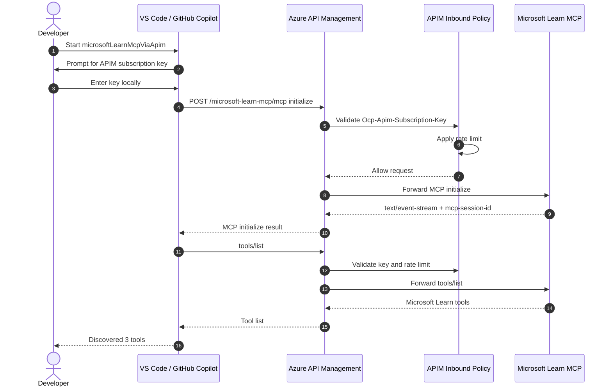
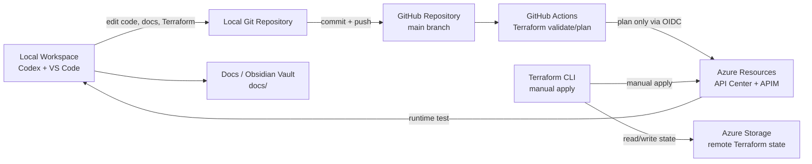

# Azure MCP Platform

Azure MCP Platform is a proof of concept for governing Model Context Protocol (MCP) servers with Azure-native services.

It shows how an organization can register approved MCP servers, expose them through a governed gateway, and let VS Code with GitHub Copilot consume an approved MCP server through that gateway.

## Table Of Contents

- [About This Repository](#about-this-repository)
  - [Goal](#goal)
  - [Scope](#scope)
  - [Out Of Scope](#out-of-scope)
- [Current Status](#current-status)
- [Conceptual Overview](#conceptual-overview)
  - [What This POC Proves](#what-this-poc-proves)
  - [MCP Platform Components](#mcp-platform-components)
  - [Supporting Delivery Components](#supporting-delivery-components)
- [Architecture](#architecture)
  - [Architecture Summary](#architecture-summary)
  - [System Context](#system-context)
  - [Azure Resource Architecture](#azure-resource-architecture)
  - [Runtime Flow](#runtime-flow)
  - [Delivery And Operations](#delivery-and-operations)
- [Authentication And Authorization](#authentication-and-authorization)
  - [POC Authentication Flow](#poc-authentication-flow)
  - [Why APIM Policy Checks The Key](#why-apim-policy-checks-the-key)
  - [Target Enterprise Authentication](#target-enterprise-authentication)
- [Azure Resources](#azure-resources)
  - [Resource Inventory](#resource-inventory)
  - [Important Endpoints](#important-endpoints)
- [Repository Structure](#repository-structure)
- [Configuration](#configuration)
  - [Terraform Variables](#terraform-variables)
  - [GitHub Actions Variables](#github-actions-variables)
  - [VS Code MCP Configuration](#vs-code-mcp-configuration)
- [Implementation Walkthrough](#implementation-walkthrough)
- [Deploy](#deploy)
- [Test](#test)
  - [Direct Gateway Smoke Test](#direct-gateway-smoke-test)
  - [VS Code / GitHub Copilot End-To-End Test](#vs-code--github-copilot-end-to-end-test)
- [Observability And Monitoring](#observability-and-monitoring)
- [Security And Governance](#security-and-governance)
  - [POC Controls](#poc-controls)
  - [Registry Metadata](#registry-metadata)
- [Cost Model](#cost-model)
- [Architecture Decisions](#architecture-decisions)
- [Known Limitations](#known-limitations)
- [Related Repositories](#related-repositories)
- [References](#references)

## About This Repository

This repository contains a public, reusable Azure proof of concept for an MCP registry and gateway architecture.

The documentation is written for readers who understand general cloud and developer platform concepts, but do not yet know this project. It should help a future maintainer, a new colleague, or an external reader understand what was built, why it was built, how it works, and how to reproduce it.

### Goal

The goal is to prove a minimal enterprise-oriented pattern for centrally governing MCP server usage:

1. Register an approved MCP server in a central registry.
2. Route MCP traffic through a gateway.
3. Enforce basic policy at the gateway.
4. Validate that VS Code with GitHub Copilot can use the approved MCP server through that gateway.

### Scope

This POC includes:

- Azure API Center as the MCP registry.
- Azure API Management as the MCP gateway.
- Microsoft Learn MCP as the first upstream MCP server.
- VS Code with GitHub Copilot as the MCP host.
- Terraform-managed Azure infrastructure.
- GitHub Actions validation and Terraform planning.
- Public-ready documentation and architecture records.

### Out Of Scope

This POC does not include:

- Custom MCP server development.
- Production-grade private networking.
- Production SLA design.
- Multi-region deployment.
- Full Entra ID/OAuth implementation for MCP clients.
- Automated `terraform apply` from GitHub Actions.

These items are intentionally deferred until the registry and gateway pattern is proven.

## Current Status

The technical POC is working.

The table below summarizes the current implementation status and the evidence behind each item.

| Area | Status | Evidence |
| --- | --- | --- |
| Azure foundation | Complete | Terraform deployed API Center, API Management, and remote state resources |
| MCP registry | Complete | Microsoft Learn MCP is registered in API Center with governance metadata |
| MCP gateway | Complete | API Management exposes Microsoft Learn MCP through an MCP API endpoint |
| Policy enforcement | Complete | APIM validates `Ocp-Apim-Subscription-Key` through policy and applies rate limiting |
| Direct gateway test | Complete | APIM returned `200`, `text/event-stream`, and `mcp-session-id` for MCP `initialize` |
| VS Code / Copilot test | Complete | VS Code discovered the Microsoft Learn MCP tools through APIM |
| Observability validation | Planned | APIM log validation should be added next |
| Target enterprise auth | Planned | Entra ID/OAuth remains the target architecture |

Validated Microsoft Learn MCP tools:

| Tool | Purpose |
| --- | --- |
| `microsoft_docs_search` | Search Microsoft Learn documentation |
| `microsoft_code_sample_search` | Search official code samples |
| `microsoft_docs_fetch` | Fetch Microsoft Learn documentation content |

## Conceptual Overview

MCP allows AI hosts such as VS Code and GitHub Copilot to call external tools. That is useful, but in an enterprise context it creates a governance problem:

> How can approved MCP servers be discovered, governed, secured, and operated centrally?

This POC separates that problem into two concerns:

- **Registry:** Which MCP servers are approved, who owns them, what risk do they have, and where are they deployed?
- **Gateway:** How does runtime MCP traffic get routed, controlled, and protected before it reaches the upstream server?

### What This POC Proves

The POC demonstrates this end-to-end path:

1. A developer opens this repository in VS Code.
2. VS Code reads the workspace MCP configuration from `.vscode/mcp.json`.
3. VS Code starts the configured Remote HTTP MCP server.
4. VS Code sends MCP traffic to Azure API Management.
5. API Management validates the subscription key through an inbound policy.
6. API Management applies rate limiting.
7. API Management forwards valid traffic to Microsoft Learn MCP.
8. GitHub Copilot discovers and can use the Microsoft Learn MCP tools.
9. Azure API Center stores registry and governance metadata for the approved MCP server.

The important result is not only that MCP traffic works. The important result is that the traffic passes through an Azure governance point before it reaches the upstream server.

### MCP Platform Components

This table only describes the logical MCP platform components. It intentionally does not include Terraform, CI/CD, or repository tooling.

| Component | Implementation | Responsibility |
| --- | --- | --- |
| MCP host | VS Code with GitHub Copilot Agent mode | Starts the MCP connection and makes tools available to the developer |
| MCP server | Microsoft Learn MCP | Provides read-only documentation and code sample tools |
| MCP registry | Azure API Center | Records approved MCP server metadata, ownership, risk, auth model, and deployment URL |
| MCP gateway | Azure API Management | Receives MCP traffic, validates access, applies policy, and forwards valid requests upstream |

### Supporting Delivery Components

This table describes the supporting engineering components that make the POC reproducible and maintainable.

| Component | Implementation | Responsibility |
| --- | --- | --- |
| Infrastructure as code | Terraform | Defines Azure resources reproducibly |
| Terraform state | Azure Storage | Stores shared remote state outside the local machine |
| CI validation | GitHub Actions | Runs Terraform validation and plan checks |
| Agent instructions | `AGENTS.md` | Captures project working conventions for Codex and other agents |
| Project documentation | `README.md` plus supporting `docs/` artifacts | Makes the architecture understandable and reusable |

## Architecture

### Architecture Summary

The POC has two architecture planes.

The table below explains the role of each plane before the diagrams go into detail.

| Plane | Purpose | Azure Service |
| --- | --- | --- |
| Governance plane | Catalog approved MCP servers and describe ownership, risk, auth, exposure, and runtime deployment | Azure API Center |
| Runtime plane | Route MCP traffic, validate access, apply policy, and protect upstream MCP servers | Azure API Management |

The first upstream MCP server is Microsoft Learn MCP at `https://learn.microsoft.com/api/mcp`.

### System Context

This diagram shows who interacts with the POC and which external systems are involved.



Alternative rendered diagram variants are available in [docs/diagram-variants](docs/diagram-variants/README.md).

### Azure Resource Architecture

This diagram shows the Azure resources deployed for the POC and how they relate to each other.



Key implementation detail: the APIM MCP API is managed with `azapi_resource` because the AzureRM provider does not expose every required MCP API shape as a first-class resource yet.

### Runtime Flow

This sequence shows what happens when VS Code starts the MCP server and discovers tools through APIM.



The APIM subscription key is entered locally in VS Code and is not committed to Git.

### Delivery And Operations

This diagram shows how local development, GitHub, Terraform, and Azure operations fit together.



For this POC, GitHub Actions validates and plans Terraform only. `terraform apply` remains manual.

## Authentication And Authorization

### POC Authentication Flow

The current POC uses an APIM subscription key because it is simple enough to validate the gateway pattern quickly.

The table below describes each authentication-related step in the current flow.

| Step | Actor | What Happens |
| --- | --- | --- |
| 1 | VS Code | Prompts the local user for the APIM subscription key |
| 2 | VS Code | Sends the key in the `Ocp-Apim-Subscription-Key` header |
| 3 | APIM inbound policy | Reads the header and compares it with a secret APIM named value |
| 4 | APIM inbound policy | Rejects missing or invalid keys with `401` |
| 5 | APIM inbound policy | Allows valid requests and applies rate limiting |
| 6 | APIM | Forwards valid MCP traffic to Microsoft Learn MCP |

### Why APIM Policy Checks The Key

APIM has built-in subscription-key support. During the POC, VS Code Remote HTTP MCP interpreted the built-in APIM authentication challenge as an OAuth/Dynamic Client Registration path.

To keep the POC simple, APIM native `subscriptionRequired` is disabled for this MCP API and the same key is checked by policy instead. This keeps the architecture on direct Remote HTTP MCP while still proving gateway policy enforcement.

This is a POC choice, not the long-term enterprise authentication model.

### Target Enterprise Authentication

The target enterprise direction is Entra ID/OAuth with an MCP-compliant authorization pattern.

| Area | POC | Target Direction |
| --- | --- | --- |
| Authentication | APIM subscription key checked by policy | Entra ID/OAuth with MCP-compliant authorization |
| Network exposure | Public APIM endpoint for local testing | Private networking, VPN, Dev Box, or controlled developer environment |
| Gateway tier | APIM Developer tier | Production-grade tier based on SLA, scale, private networking, and observability needs |
| Server scope | One read-only MCP server | Multiple approved MCP servers with registry-driven discovery |

## Azure Resources

### Resource Inventory

This table lists the Azure resources and logical objects used by the POC. It answers: "What exists in Azure, and what role does it play?"

| Resource Or Object | Example Pattern | Role In The POC |
| --- | --- | --- |
| Resource group | `rg-<project>-<env>` | Groups all Azure resources for the development environment |
| Storage account | `<unique-storage-account-name>` | Stores Terraform remote state |
| Blob container | `tfstate` | Holds the Terraform state blob |
| API Center | `apic-<project>-<env>` | Acts as the MCP registry |
| API Center API | `microsoft-learn-mcp` | Represents the approved Microsoft Learn MCP server |
| API Center environment | `apim-dev` | Represents the APIM development gateway environment |
| API Center deployment | `apim-dev` | Points registry metadata to the APIM runtime URL |
| API Management | `apim-<project>-<env>` | Acts as the MCP gateway |
| APIM API | `microsoft-learn-mcp` | Exposes the MCP endpoint through APIM |
| APIM product | `mcp-poc` | Groups gateway access for the POC |
| APIM subscription | `mcp-poc` subscription | Provides the subscription key used by VS Code |
| APIM named value | `mcp-poc-gateway-key` | Stores the expected key as a secret for policy comparison |
| APIM API policy | Inbound policy | Validates the key and applies rate limiting |

### Important Endpoints

This table lists the URLs a reader needs when testing or reasoning about the runtime path.

| Purpose | Endpoint |
| --- | --- |
| APIM gateway base URL | `https://<apim-name>.azure-api.net` |
| Microsoft Learn MCP through APIM | `https://<apim-name>.azure-api.net/microsoft-learn-mcp/mcp` |
| Upstream Microsoft Learn MCP | `https://learn.microsoft.com/api/mcp` |
| API Center MCP registry | `https://<api-center-name>.data.<region>.azure-apicenter.ms/workspaces/default/v0.1/servers` |

## Repository Structure

```text
.
├── AGENTS.md
├── README.md
├── SECURITY.md
├── LICENSE
├── .github/
│   ├── azure-federated-credential.example.json
│   └── workflows/terraform-validate.yml
├── .vscode/
│   └── mcp.json
├── docs/
│   ├── decisions/
│   ├── diagram-variants/
│   ├── diagrams/
│   ├── runbooks/
│   └── references.md
└── infra/terraform/
```

The table below explains the repository folders and files that matter most to a new reader.

| Path | Purpose |
| --- | --- |
| [README.md](README.md) | Main project documentation and first entry point |
| [AGENTS.md](AGENTS.md) | Project working conventions for Codex and other coding agents |
| [.vscode/mcp.json](.vscode/mcp.json) | VS Code Remote HTTP MCP server configuration |
| [infra/terraform](infra/terraform) | Terraform implementation for Azure resources |
| [docs/decisions](docs/decisions) | Architecture Decision Records |
| [docs/runbooks](docs/runbooks) | Operational procedures and manual test instructions |
| [docs/diagram-variants](docs/diagram-variants/README.md) | Alternative diagram sources and rendered variants |
| [docs/references.md](docs/references.md) | Consolidated source references |

The root README is the primary documentation surface. Files under `docs/` are supporting artifacts, runbooks, or appendices.

## Configuration

### Terraform Variables

Create a local variables file from the example:

```bash
cp infra/terraform/environments/dev/terraform.tfvars.example \
  infra/terraform/environments/dev/terraform.tfvars
```

Then replace the placeholder values in `terraform.tfvars`.

Local `*.tfvars` files are ignored by Git. Keep them local because they can contain personal, subscription-specific, or environment-specific values.

### GitHub Actions Variables

The Terraform validation workflow expects these repository variables.

| Variable | Purpose |
| --- | --- |
| `AZURE_CLIENT_ID` | Entra app registration client ID for GitHub OIDC |
| `AZURE_TENANT_ID` | Entra tenant ID |
| `AZURE_SUBSCRIPTION_ID` | Azure subscription ID |
| `TF_STATE_RESOURCE_GROUP_NAME` | Resource group containing Terraform state storage |
| `TF_STATE_STORAGE_ACCOUNT_NAME` | Storage account for Terraform state |
| `TF_STATE_CONTAINER_NAME` | Blob container for Terraform state |
| `TF_STATE_KEY` | State blob name, for example `dev.terraform.tfstate` |
| `API_CENTER_NAME` | API Center instance name |
| `API_MANAGEMENT_NAME` | API Management instance name |
| `API_MANAGEMENT_PUBLISHER_EMAIL` | APIM publisher email |

### VS Code MCP Configuration

The workspace MCP configuration lives in [.vscode/mcp.json](.vscode/mcp.json).

It defines one Remote HTTP MCP server.

| Setting | Value |
| --- | --- |
| Server name | `microsoftLearnMcpViaApim` |
| Type | `http` |
| URL | `https://<apim-name>.azure-api.net/microsoft-learn-mcp/mcp` |
| Header | `Ocp-Apim-Subscription-Key` |
| Secret handling | VS Code prompts locally; the key is not committed |

## Implementation Walkthrough

This section explains the logical setup sequence. It is not a click-by-click deployment runbook; it is meant to help a reader understand how the pieces were assembled.

| Step | What Was Set Up | Why It Matters |
| --- | --- | --- |
| 1 | GitHub repository | Provides versioned source control for Terraform, docs, decisions, and runbooks |
| 2 | Azure foundation | Provides the subscription, resource group, and remote state foundation for repeatable infrastructure |
| 3 | Terraform backend | Moves state out of the local machine and into Azure Storage |
| 4 | GitHub OIDC | Lets GitHub Actions plan against Azure without long-lived cloud credentials |
| 5 | Azure API Center | Creates the registry for approved MCP server metadata |
| 6 | Azure API Management | Creates the runtime gateway for MCP traffic |
| 7 | Microsoft Learn MCP APIM API | Exposes the upstream MCP server through the gateway |
| 8 | APIM policy | Validates the key and applies rate limiting |
| 9 | API Center metadata | Records owner, risk, auth type, exposure, and runtime deployment URL |
| 10 | VS Code MCP config | Lets VS Code/GitHub Copilot connect to the APIM MCP endpoint |
| 11 | End-to-end test | Proves that Copilot can discover Microsoft Learn MCP tools through APIM |

## Deploy

Prerequisites:

| Tool | Purpose |
| --- | --- |
| Azure CLI | Azure login and subscription context |
| Terraform CLI | Infrastructure deployment |
| GitHub CLI | GitHub repository and workflow setup |
| VS Code | MCP host validation |
| GitHub Copilot | MCP tool consumption from Copilot Chat |

Initialize Terraform:

```bash
terraform -chdir=infra/terraform init
```

Validate Terraform:

```bash
terraform -chdir=infra/terraform validate
```

Plan Terraform:

```bash
SUB=$(az account show --query id -o tsv)
TENANT=$(az account show --query tenantId -o tsv)

terraform -chdir=infra/terraform plan \
  -var-file="environments/dev/terraform.tfvars" \
  -var="subscription_id=$SUB" \
  -var="tenant_id=$TENANT"
```

Apply manually:

```bash
terraform -chdir=infra/terraform apply \
  -var-file="environments/dev/terraform.tfvars" \
  -var="subscription_id=$SUB" \
  -var="tenant_id=$TENANT"
```

## Test

### Direct Gateway Smoke Test

The direct gateway test verifies APIM before VS Code is involved.

| Test | Expected Result |
| --- | --- |
| Valid APIM key | `200`, `text/event-stream`, `mcp-session-id` |
| Missing APIM key | `401` from APIM policy |
| Invalid APIM key | `401` from APIM policy |
| Repeated calls beyond limit | `429` throttling response |

### VS Code / GitHub Copilot End-To-End Test

Get the APIM subscription key:

```bash
terraform -chdir=infra/terraform output -raw mcp_poc_subscription_primary_key
```

Then:

1. Open this repository in VS Code.
2. Open the Command Palette with `Shift` + `Command` + `P`.
3. Run `MCP: List Servers`.
4. Select `microsoftLearnMcpViaApim`.
5. Choose `Start Server`.
6. Enter the APIM subscription key when prompted.
7. Open GitHub Copilot Chat in Agent mode.
8. Confirm the Microsoft Learn MCP tools are available.

Expected VS Code output:

```text
Starting server microsoftLearnMcpViaApim
Connection state: Running
Discovered 3 tools
```

Prompt example:

```text
Use the Microsoft Learn MCP server to find official guidance for exposing an existing MCP server through Azure API Management.
```

Detailed runbook: [docs/runbooks/vscode-copilot-mcp-test.md](docs/runbooks/vscode-copilot-mcp-test.md)

## Observability And Monitoring

Observability is planned but not fully documented yet.

The POC should be able to show that gateway operation is visible, not only that connectivity works. The table below defines the observability checks that should be added next.

| Check | Purpose | Status |
| --- | --- | --- |
| APIM request logs | Show requests to `/microsoft-learn-mcp/mcp` | Planned |
| Status code visibility | Confirm successful, unauthorized, and throttled requests are visible | Planned |
| Latency visibility | Understand gateway and upstream response behavior | Planned |
| Failed key attempts | Prove that denied requests can be audited | Planned |
| Rate-limit events | Prove that throttling is visible operationally | Planned |

## Security And Governance

### POC Controls

This table summarizes the current controls. It answers: "How is the POC governed today?"

| Control | Implementation |
| --- | --- |
| Gateway access | APIM requires `Ocp-Apim-Subscription-Key` |
| Key validation | APIM inbound policy compares the header against a secret named value |
| Rate limiting | APIM policy limits calls per time window |
| Registry metadata | API Center records owner, status, risk, auth type, network exposure, tool access, and purpose |
| Terraform state | Remote state stored in Azure Storage |
| CI authentication | GitHub Actions uses OIDC for Azure-backed Terraform plans |
| Secret hygiene | Local `*.tfvars`, state files, plans, and credentials are ignored by Git |

### Registry Metadata

API Center records the Microsoft Learn MCP server with governance metadata.

| Field | Example Value |
| --- | --- |
| `owner` | `platform-team` |
| `environment` | `dev` |
| `status` | `approved` |
| `riskLevel` | `low` |
| `dataClassification` | `public` |
| `authType` | `subscription-key` |
| `networkExposure` | `public-poc` |
| `toolAccess` | `read-only` |
| `businessPurpose` | Microsoft Learn documentation lookup through governed MCP access |
| `upstreamServer` | `https://learn.microsoft.com/api/mcp` |
| `approvedForHosts` | VS Code, GitHub Copilot |
| `lastReviewed` | Review date for the registry entry |
| `documentationUrl` | `https://learn.microsoft.com/` |

## Cost Model

The main cost driver is Azure API Management.

This table separates the cost-relevant components and the expected cost character.

| Component | Cost Character |
| --- | --- |
| API Management Developer tier | Ongoing monthly cost while provisioned; non-production and no SLA |
| API Center | Depends on Azure pricing and SKU availability |
| Storage account for Terraform state | Very small cost for this POC |
| Microsoft Learn MCP | External Microsoft endpoint; no custom hosting cost in this repo |

To avoid unnecessary spend, deprovision the Azure resources when the POC is not needed.

## Architecture Decisions

This table summarizes the durable decisions behind the current POC architecture.

| Decision | Chosen Option | Why |
| --- | --- | --- |
| Registry | Azure API Center | Azure-native catalog for approved MCP server metadata and discovery |
| Gateway | Azure API Management | Azure-native policy enforcement, routing, subscription keys, and rate limiting |
| Initial MCP server | Microsoft Learn MCP | Useful read-only tools without custom server development |
| Initial host | VS Code with GitHub Copilot | Real target developer experience |
| Authentication for POC | Subscription key checked by APIM policy | Fast validation without OAuth setup |
| Enterprise auth direction | Entra ID/OAuth | Better fit for identity-based enterprise governance |
| Network model for POC | Public APIM endpoint | Faster local testing |
| Target network model | Private or controlled access path | Better enterprise security posture |
| Apply model | Manual Terraform apply | Keeps POC changes deliberate while CI validates and plans |

Detailed ADR: [ADR-001: Use Azure API Center and API Management for the MCP Registry/Gateway POC](docs/decisions/001-mcp-registry-gateway-poc.md)

## Known Limitations

This table lists the known boundaries of the current POC so readers do not mistake it for a production architecture.

| Limitation | Impact | Follow-Up |
| --- | --- | --- |
| APIM Developer tier has no SLA | Not production-ready | Evaluate production tiers later |
| Public APIM endpoint | Easier to test, weaker than private enterprise pattern | Add private networking or controlled developer access path |
| Subscription key auth | Good POC shortcut, weaker than identity-based auth | Design Entra ID/OAuth target architecture |
| One upstream MCP server | Proves the pattern, not full registry scale | Add more MCP servers after the platform pattern is stable |
| Observability not fully documented | Gateway operations are not yet easy to demonstrate | Add APIM log checks and Azure Monitor validation |

## Related Repositories

This repository contains only the Azure MCP Platform POC.

| Repository | Purpose | Visibility Intent |
| --- | --- | --- |
| `azure-mcp-platform` | Concrete Azure MCP registry/gateway POC | Public reference POC |
| `codex-cloud-workbench` | Personal cloud/Codex enablement and local workbench | Private |
| `codex-azure-project-template` | Reusable Azure/Codex project template and standards | Private |

## References

Core references used for this POC:

| Area | Reference |
| --- | --- |
| MCP architecture | [Model Context Protocol architecture](https://modelcontextprotocol.io/docs/learn/architecture) |
| MCP authorization | [MCP authorization specification](https://modelcontextprotocol.io/specification/2025-06-18/basic/authorization) |
| VS Code MCP servers | [VS Code MCP servers](https://code.visualstudio.com/docs/agent-customization/mcp-servers) |
| VS Code MCP configuration | [VS Code MCP configuration reference](https://code.visualstudio.com/docs/agents/reference/mcp-configuration) |
| APIM MCP gateway | [Expose and govern an existing MCP server with Azure API Management](https://learn.microsoft.com/en-us/azure/api-management/expose-existing-mcp-server) |
| API Center MCP registry | [Register and discover MCP servers in Azure API Center](https://learn.microsoft.com/en-us/azure/api-center/register-discover-mcp-server) |
| API Center metadata | [Set metadata properties in Azure API Center](https://learn.microsoft.com/en-us/azure/api-center/set-metadata-properties) |
| Terraform Azure backend | [Terraform AzureRM backend](https://developer.hashicorp.com/terraform/language/backend/azurerm) |
| GitHub OIDC for Azure | [GitHub Actions OIDC in Azure](https://docs.github.com/en/actions/how-tos/secure-your-work/security-harden-deployments/oidc-in-azure) |
| API Management pricing | [Azure API Management pricing](https://azure.microsoft.com/en-us/pricing/details/api-management/) |

Additional references are collected in [docs/references.md](docs/references.md).
