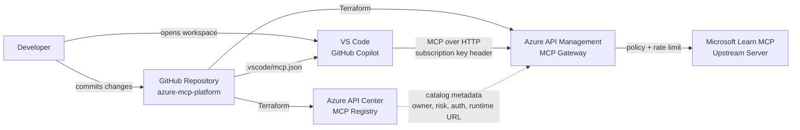
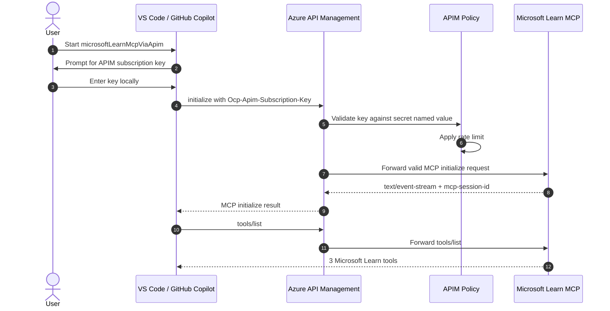

# Azure MCP Platform

Proof of concept for an Azure-based Model Context Protocol (MCP) registry and gateway architecture.

The POC exposes the Microsoft Learn MCP server through Azure API Management, registers it in Azure API Center, and validates access from VS Code with GitHub Copilot.

## Table Of Contents

- [Why This Exists](#why-this-exists)
- [Current Status](#current-status)
- [Architecture Overview](#architecture-overview)
- [Runtime Flow](#runtime-flow)
- [Azure Resources](#azure-resources)
- [Repository Structure](#repository-structure)
- [How To Deploy](#how-to-deploy)
- [How To Test](#how-to-test)
- [Governance And Security](#governance-and-security)
- [Documentation](#documentation)
- [Related Repositories](#related-repositories)
- [Next Steps](#next-steps)
- [References](#references)

## Why This Exists

MCP allows AI hosts such as VS Code/GitHub Copilot to call external tools. In an enterprise context, that creates an obvious governance question:

> How can approved MCP servers be discovered, governed, secured, and operated centrally?

This repository proves a minimal Azure-native answer:

- **Registry**: Azure API Center documents approved MCP servers and metadata.
- **Gateway**: Azure API Management controls runtime access to MCP servers.
- **Host**: VS Code/GitHub Copilot consumes the MCP server.
- **Initial server**: Microsoft Learn MCP provides useful read-only documentation tools.

The goal is not to build a custom MCP server yet. The goal is to prove registry, gateway, policy, and host integration first.

## Current Status

Completed:

- GitHub repository initialized and pushed.
- Azure development subscription enabled.
- Terraform remote state stored in Azure Storage.
- GitHub OIDC configured for Azure-backed Terraform plans.
- Azure API Center deployed as MCP registry.
- Azure API Management Developer tier deployed as MCP gateway.
- Microsoft Learn MCP exposed through APIM.
- APIM validates `Ocp-Apim-Subscription-Key` through policy.
- APIM rate limit policy is configured.
- VS Code/GitHub Copilot discovered three Microsoft Learn MCP tools through APIM.

Validated MCP tools:

- `microsoft_docs_search`
- `microsoft_code_sample_search`
- `microsoft_docs_fetch`

## Architecture Overview



The architecture has two distinct planes:

| Plane | Purpose | Main Services |
| --- | --- | --- |
| Governance plane | Discover and describe approved MCP servers | Azure API Center |
| Runtime plane | Enforce access and route MCP traffic | Azure API Management |

## Runtime Flow



The VS Code workspace configuration lives in [.vscode/mcp.json](.vscode/mcp.json):

```json
{
  "servers": {
    "microsoftLearnMcpViaApim": {
      "type": "http",
      "url": "https://<apim-name>.azure-api.net/microsoft-learn-mcp/mcp",
      "headers": {
        "Ocp-Apim-Subscription-Key": "${input:apim-subscription-key-remote-http-v1}"
      }
    }
  }
}
```

## Azure Resources

| Purpose | Resource |
| --- | --- |
| Resource group | `rg-<project>-<env>` |
| Location | `westeurope` |
| Terraform state storage account | `<unique-storage-account-name>` |
| Terraform state container | `tfstate` |
| API Center registry | `apic-<project>-<env>` |
| API Management gateway | `apim-<project>-<env>` |
| APIM API | `microsoft-learn-mcp` |
| APIM API type | `mcp` |
| APIM product | `mcp-poc` |
| API Center API | `microsoft-learn-mcp` |
| API Center environment | `apim-dev` |
| API Center deployment | `apim-dev` |

Important endpoints:

| Purpose | Endpoint |
| --- | --- |
| APIM gateway | `https://<apim-name>.azure-api.net` |
| Microsoft Learn MCP through APIM | `https://<apim-name>.azure-api.net/microsoft-learn-mcp/mcp` |
| Upstream Microsoft Learn MCP | `https://learn.microsoft.com/api/mcp` |
| API Center MCP registry | `https://<api-center-name>.data.<region>.azure-apicenter.ms/workspaces/default/v0.1/servers` |

## Repository Structure

```text
.
├── AGENTS.md
├── README.md
├── .github/workflows/
├── .vscode/mcp.json
├── docs/
│   ├── architecture.md
│   ├── decisions/
│   ├── diagrams/
│   └── runbooks/
└── infra/terraform/
```

Key files:

| Path | Purpose |
| --- | --- |
| [AGENTS.md](AGENTS.md) | Codex/project working conventions |
| [README.md](README.md) | Main project documentation |
| [infra/terraform](infra/terraform) | Azure infrastructure as code |
| [.vscode/mcp.json](.vscode/mcp.json) | VS Code MCP configuration |
| [docs/architecture.md](docs/architecture.md) | Architecture details |
| [docs/decisions](docs/decisions) | Architecture Decision Records |
| [docs/runbooks](docs/runbooks) | Operational procedures |

## How To Deploy

Prerequisites:

- Azure CLI
- Terraform CLI
- GitHub CLI
- Azure subscription

Create a local Terraform variables file from the example:

```bash
cp infra/terraform/environments/dev/terraform.tfvars.example \
  infra/terraform/environments/dev/terraform.tfvars
```

Then replace the placeholder values in `terraform.tfvars`. Local `*.tfvars` files are ignored by Git.

Initialize Terraform:

```bash
terraform -chdir=infra/terraform init
```

Validate:

```bash
terraform -chdir=infra/terraform validate
```

Plan:

```bash
SUB=$(az account show --query id -o tsv)
TENANT=$(az account show --query tenantId -o tsv)

terraform -chdir=infra/terraform plan \
  -var-file="environments/dev/terraform.tfvars" \
  -var="subscription_id=$SUB" \
  -var="tenant_id=$TENANT"
```

Apply remains manual for this POC:

```bash
terraform -chdir=infra/terraform apply
```

## How To Test

Get the APIM subscription key:

```bash
terraform -chdir=infra/terraform output -raw mcp_poc_subscription_primary_key
```

Open this repository in VS Code.

Then:

1. Open the Command Palette with `Shift` + `Command` + `P`.
2. Run `MCP: List Servers`.
3. Select `microsoftLearnMcpViaApim`.
4. Choose `Start Server`.
5. Enter the 32-character APIM subscription key.
6. Open GitHub Copilot Chat in Agent mode.
7. Confirm Microsoft Learn MCP tools are available.

Expected VS Code output:

```text
Starting server microsoftLearnMcpViaApim
Connection state: Running
Discovered 3 tools
```

Full runbook: [docs/runbooks/vscode-copilot-mcp-test.md](docs/runbooks/vscode-copilot-mcp-test.md)

## GitHub Actions Variables

The Terraform validation workflow expects these repository variables:

| Variable | Purpose |
| --- | --- |
| `AZURE_CLIENT_ID` | Entra app registration client ID for GitHub OIDC |
| `AZURE_TENANT_ID` | Entra tenant ID |
| `AZURE_SUBSCRIPTION_ID` | Azure subscription ID |
| `TF_STATE_RESOURCE_GROUP_NAME` | Resource group containing Terraform state storage |
| `TF_STATE_STORAGE_ACCOUNT_NAME` | Storage account for Terraform state |
| `TF_STATE_CONTAINER_NAME` | Blob container for Terraform state |
| `TF_STATE_KEY` | State blob name, for example `dev.terraform.tfstate` |
| `API_CENTER_NAME` | API Center instance name |
| `API_MANAGEMENT_NAME` | API Management instance name |
| `API_MANAGEMENT_PUBLISHER_EMAIL` | APIM publisher email |

## Governance And Security

POC controls:

- APIM requires an `Ocp-Apim-Subscription-Key` header.
- APIM validates the key through an inbound policy.
- APIM applies rate limiting.
- API Center stores governance metadata for the MCP server.
- Terraform state is remote in Azure Storage.
- GitHub Actions uses OIDC for Azure-backed plans.

Known POC trade-offs:

- Subscription keys are suitable for this POC but are not the enterprise target.
- The APIM endpoint is public for local testing.
- APIM Developer tier is non-production and has no SLA.
- The POC key should be rotated because it was exposed during interactive setup.

Target direction:

- Entra ID/OAuth for enterprise authentication.
- Private networking or controlled developer environments.
- Better observability through APIM logs and Azure Monitor.
- More than one MCP server to prove registry and discovery patterns.

## Documentation

This repository uses a README-first documentation model:

- The root [README.md](README.md) is the single narrative entry point.
- Detail files under `docs/` exist for runbooks, decisions, and deeper architecture notes.
- Architecture diagrams are embedded where they help explain the POC.
- Alternative diagram tool outputs are available for review in [docs/diagram-variants](docs/diagram-variants/README.md).
- Consolidated source references are collected in [docs/references.md](docs/references.md).

## Related Repositories

This repository is only the MCP platform POC.

Project-independent enablement and standards are split into separate repositories:

| Repository | Purpose |
| --- | --- |
| `azure-mcp-platform` | Concrete Azure MCP registry/gateway POC |
| `codex-cloud-workbench` | Personal cloud/Codex workbench and local enablement |
| `codex-azure-project-template` | Reusable Azure/Codex project template and standards |

The portable project-specific conventions for this repository remain in [AGENTS.md](AGENTS.md).

## Next Steps

1. Run a Copilot chat prompt that invokes one of the discovered Microsoft Learn MCP tools.
2. Add APIM observability checks.
3. Rotate any APIM subscription key that was exposed during local testing.
4. Start ADR-002 for the target OAuth/Entra ID architecture.
5. Review the diagram variants and choose a preferred diagram style.

## References

See [docs/references.md](docs/references.md).
