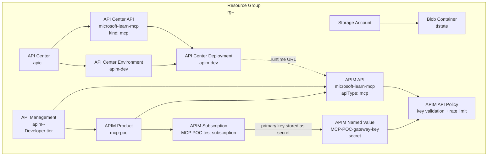

# Azure Resources

This diagram shows the Azure resources deployed for the POC and their relationships.

## Key Points

- Terraform state is remote in Azure Storage.
- API Center records the approved MCP server and deployment metadata.
- API Management exposes the runtime MCP endpoint.
- APIM policy validates the subscription key and applies rate limiting.
- The APIM named value keeps the policy comparison secret-backed.
