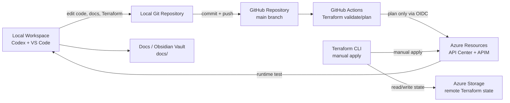

# Delivery And Operations

This diagram shows how local development, GitHub, Terraform, and Azure operations fit together.

## Key Points

- Local work is committed and pushed to GitHub.
- GitHub Actions validates and plans Terraform, but does not apply production changes.
- Terraform apply is manual for the POC.
- Remote state lives in Azure Storage.
- `docs/` works as both repository documentation and an Obsidian vault.
