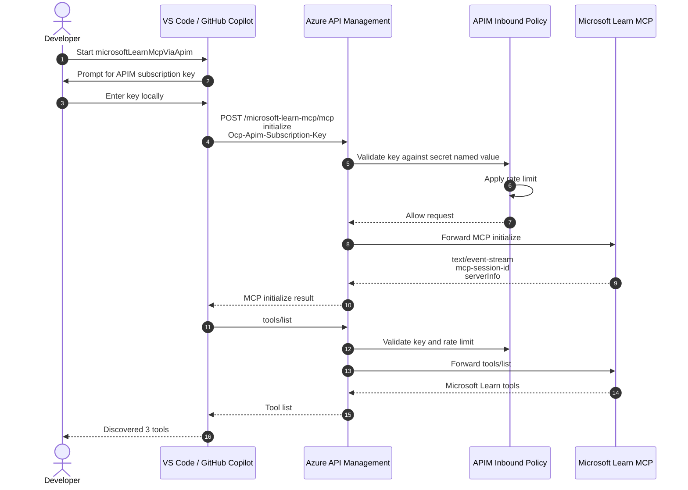

# Runtime Flow

This sequence shows what happens when VS Code starts the MCP server and discovers tools through APIM.

## Key Points

- The APIM subscription key is entered locally in VS Code and is not committed to Git.
- APIM native `subscriptionRequired` is disabled for this API.
- The inbound policy performs the POC key check to avoid triggering an OAuth challenge.
- Successful startup is visible in VS Code output as `Discovered 3 tools`.
