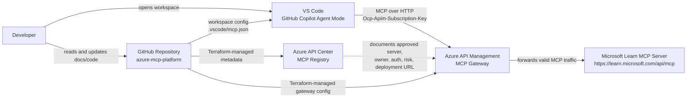

# System Context

This diagram shows the main actors and systems in the MCP registry/gateway POC.

## Key Points

- VS Code/GitHub Copilot is the MCP host.
- API Management is the runtime gateway for MCP traffic.
- API Center is the registry and governance catalog.
- Microsoft Learn MCP is the first upstream MCP server.
- Terraform keeps the Azure platform configuration reproducible.
